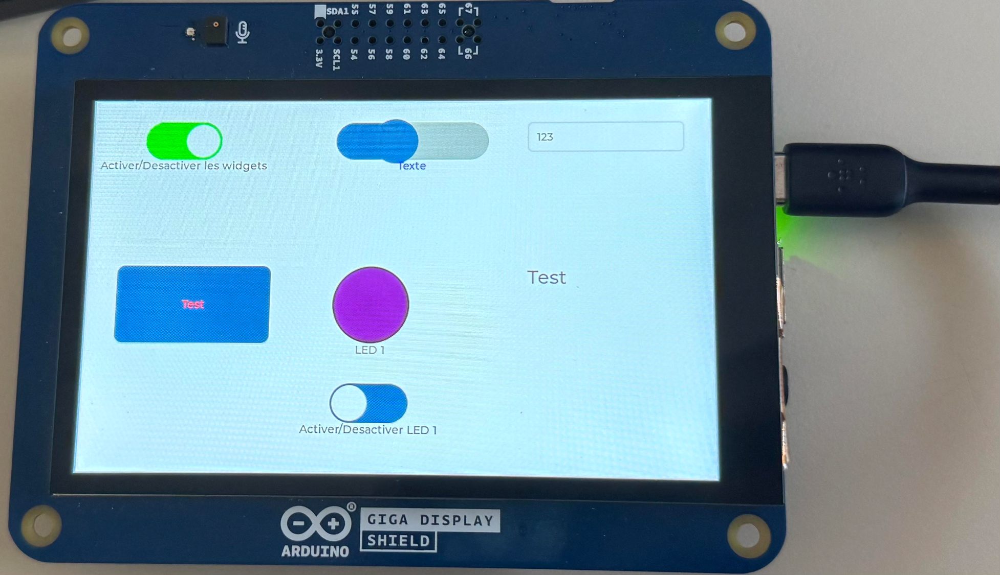

# E2MMA – Educational Electrical Model Manager

Projet de fin d'études réalisé dans le cadre de mon **BTS CIEL – Informatique et Réseaux**.

E2MMA est un système embarqué permettant de **contrôler, configurer et superviser différentes maquettes pédagogiques** depuis une interface graphique tactile.

L'objectif principal du projet était de proposer une solution suffisamment **modulaire** pour pouvoir adapter automatiquement l'interface et son fonctionnement à différentes maquettes, sans avoir à développer une nouvelle application pour chacune d'elles.

<p align="center">
  
</p>

---

## Objectifs du projet

Le système E2MMA permet notamment de :

- charger la configuration d'une maquette depuis un fichier XML ;
- générer dynamiquement une interface graphique adaptée ;
- afficher et modifier différents paramètres ;
- commander les actionneurs d'une maquette ;
- récupérer et afficher les mesures provenant des capteurs ;
- configurer différents paramètres d'asservissement ;
- enregistrer les mesures au format CSV ;
- utiliser des composants matériels accessibles et standardisés.

L'objectif était de disposer d'une architecture facilement adaptable à différentes maquettes utilisées dans un contexte pédagogique.

---

## Architecture générale

Le système repose principalement sur une **Arduino GIGA R1 WiFi** associée à un **GIGA Display Shield**.

Le fonctionnement général est le suivant :

1. Le système recherche les configurations de maquettes disponibles sur le support de stockage.
2. L'utilisateur sélectionne une maquette.
3. Le fichier XML correspondant est chargé.
4. Le fichier est analysé par le parser XML.
5. Les widgets définis dans le fichier sont créés.
6. L'interface graphique correspondante est générée sur l'écran tactile.
7. L'utilisateur peut interagir avec la maquette depuis l'IHM.
8. Le système communique avec les capteurs et actionneurs.
9. Les mesures peuvent être enregistrées au format CSV.

Cette architecture permet de modifier l'interface et son comportement principalement à travers les fichiers de configuration.

---

## Technologies utilisées

- **C++**
- **Arduino**
- **Arduino GIGA R1 WiFi**
- **GIGA Display Shield**
- **LVGL**
- **XML**
- **CSV**
- Programmation orientée objet
- Systèmes embarqués
- Interfaces graphiques tactiles
- Communication avec des capteurs et actionneurs

---

## Interface graphique et système de Widgets

Une partie importante du projet a consisté à développer une **surcouche C++ autour de LVGL** afin de simplifier la création et la gestion des éléments graphiques.

Une classe générique `Widget` contient les propriétés et comportements communs aux différents composants.

Plusieurs widgets spécialisés héritent ensuite de cette classe :

- `Button`
- `Label`
- `Slider`
- `Switch`
- `Dropdown`
- `Led`
- `WTextArea`
- `WKeyboard`

Cette architecture permet de manipuler les différents composants à travers une structure commune tout en conservant leurs comportements spécifiques.

Elle met notamment en œuvre plusieurs principes de programmation orientée objet :

- héritage ;
- encapsulation ;
- abstraction ;
- polymorphisme.

### Exemple

```cpp
void Button::draw() {
    lv_style_t *temp_style = this->getStyle();

    lv_style_set_bg_color(
        temp_style,
        lv_color_make(
            this->getColorR(),
            this->getColorG(),
            this->getColorB()
        )
    );

    lv_obj_t* btn = lv_btn_create(display);

    lv_obj_set_pos(btn, this->getX(), this->getY());
    lv_obj_set_size(btn, this->getSizeX(), this->getSizeY());
    lv_obj_add_style(btn, temp_style, 0);
}
```

---

## Gestion de l'interface

La classe `UIE2mma` centralise la gestion des widgets présents dans l'interface.

Elle utilise notamment le **pattern Singleton** afin de disposer d'une instance unique du gestionnaire de l'IHM.

```cpp
UIE2mma* UIE2mma::getInstance() {
    if (!instance) {
        instance = new UIE2mma;
    }

    return instance;
}
```

Les widgets créés à partir de la configuration XML peuvent ensuite être stockés et administrés depuis ce gestionnaire.

---

## Configuration XML

L'un des objectifs du projet était de rendre le système facilement adaptable à plusieurs maquettes.

Les interfaces peuvent donc être décrites à l'aide de **fichiers XML**.

Le parser analyse la configuration sélectionnée puis permet au programme de créer les composants graphiques correspondants.

Exemples présents dans le dépôt :

- `VEL1.xml`
- `maquette_test.xml`

Cette approche permet de séparer une partie de la configuration de l'interface du code principal de l'application.

---

## Gestion des fichiers

Le projet comprend également une partie dédiée à la gestion du stockage.

Elle permet notamment :

- la détection et la gestion du support USB ;
- la recherche des fichiers de configuration ;
- le chargement des fichiers XML ;
- la création et l'enregistrement de fichiers CSV ;
- l'archivage des mesures réalisées pendant les expérimentations.

---

## Exemple d'utilisation

Une maquette peut par exemple proposer :

- une consigne de position ;
- l'affichage de la position mesurée ;
- le réglage des coefficients **P, I et D** ;
- le réglage de la fréquence d'échantillonnage ;
- des boutons, sliders, LEDs et champs de saisie générés dans l'interface.

Les valeurs peuvent ensuite être utilisées pour piloter la maquette et visualiser son comportement en temps réel.

---

## Difficultés techniques rencontrées

Le développement sur système embarqué m'a également confronté à des problématiques bas niveau.

Lors du développement, une mauvaise gestion d'un pointeur a notamment provoqué une écriture à l'adresse `0x00`, entraînant le crash de la carte.

La récupération du système a nécessité la réinstallation du firmware et du bootloader à l'aide notamment de :

- `dfu-util`
- `STM32CubeProgrammer`

Cette situation m'a permis d'approfondir le débogage C++ ainsi que le fonctionnement de la plateforme embarquée utilisée.

---

## Ma contribution

Ce projet a été réalisé initialement dans une équipe de quatre étudiants.

Ma responsabilité principale concernait la conception et le développement de la **couche graphique Widget**, permettant d'abstraire LVGL et de créer les différents composants de l'interface en C++.

Au cours du projet, j'ai également pris en charge une grande partie des autres composants logiciels afin d'assurer l'intégration et l'aboutissement du système, notamment :

- le système de widgets et l'IHM ;
- le parsing des configurations XML ;
- la gestion des fichiers et du stockage ;
- l'intégration des différents composants du système ;
- les tests et le débogage de l'application.

La partie `e2mma` présente dans ce dépôt n'a pas été développée par moi.

---

## Structure du dépôt

```text
E2MMA/
│
├── Widget/          # Composants graphiques et abstraction de LVGL
├── XmlParser/       # Analyse des fichiers de configuration XML
├── FileE2MMA/       # Gestion des fichiers et du stockage
├── e2mma/           # Partie du projet développée par un autre membre
│
├── VEL1.xml         # Configuration d'une maquette
├── maquette_test.xml
│
├── VEL1.ino
├── interface.ino
├── ui.ino
├── usb.ino
└── ...
```

---

## Compétences développées

Ce projet m'a permis de mettre en pratique et d'approfondir :

- le développement en **C++** ;
- la **programmation orientée objet** ;
- la conception d'une architecture logicielle modulaire ;
- le développement sur **système embarqué** ;
- la création d'interfaces graphiques avec **LVGL** ;
- le parsing de fichiers **XML** ;
- la manipulation et l'enregistrement de données ;
- le débogage logiciel et matériel ;
- l'intégration de plusieurs composants au sein d'une même application.

---

## Contexte

Projet réalisé dans le cadre du **BTS CIEL – Cybersécurité, Informatique et réseaux, Électronique**, option Informatique et Réseaux.

L'objectif final était de disposer d'une plateforme pédagogique réutilisable sur différentes maquettes plutôt que de développer une solution spécifique pour chaque système.
