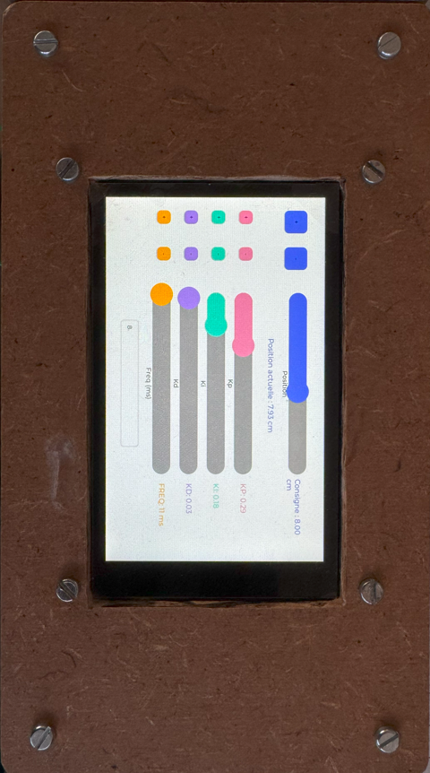
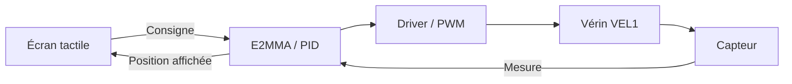
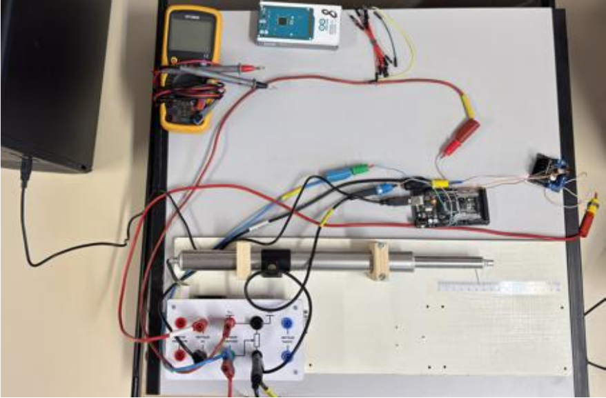

<h1 align="center">E2MMA</h1>

<p align="center">
  <strong>Du réglage sur écran tactile au déplacement d'un vérin.</strong><br>
  Educational Electrical Model Manager · Projet de BTS CIEL
</p>

<p align="center">
  
  
  
  
</p>

<p align="center">
  <a href="#le-projet">Le projet</a> ·
  <a href="#ma-contribution">Ma contribution</a> ·
  <a href="#du-capteur-au-mouvement">Fonctionnement</a> ·
  <a href="#sur-le-banc-dessai">Essais</a> ·
  <a href="#explorer-le-code">Code</a>
</p>

<p align="center">
  
  <br>
  <sub>L'interface de pilotage du vérin : consigne, retour de position, gains du PID et période d'échantillonnage.</sub>
</p>

## Le projet

J'ai travaillé sur E2MMA pendant mon **BTS CIEL, option Informatique et Réseaux**, au lycée La Fayette. Le besoin venait des enseignants : disposer d'une interface commune pour piloter des maquettes de travaux pratiques, lire leurs capteurs et expérimenter différents réglages d'asservissement.

Ma partie portait sur **VEL1, une maquette équipée d'un vérin électrique dont la course physique est d'environ 16 cm**. Il fallait pouvoir choisir une position à l'écran, récupérer la position réelle du vérin et ajuster la commande du moteur à partir de l'écart entre les deux.

Je présente ici mon travail sur la commande du vérin, les essais matériels et leur intégration à l'IHM. Le projet a été réalisé en équipe ; le [dépôt principal est maintenu par Mathis, alias Nyteross](https://github.com/Nyteross/E2MMA).

| Élément | Utilisation dans le projet |
| --- | --- |
| **Arduino GIGA R1 WiFi** | Exécution du programme, acquisition et commande |
| **GIGA Display Shield** | Interface tactile de 800 × 480 pixels |
| **Vérin VEL1 et capteur analogique intégré** | Déplacement et retour de position |
| **Driver moteur Joy-IT MotoDriver2** | Pilotage du moteur dans les deux sens par PWM |
| **Arduino Mega 2560** | Premiers essais sur le montage |

## Ma contribution

J'ai développé la **classe C++ `E2MMA`**, qui fait le lien entre les capteurs, le calcul de la commande et les sorties vers le moteur. Mon travail a couvert plusieurs étapes :

- **Tester la maquette** : vérifier le câblage, lire le capteur et commander l'extension puis la rétraction du vérin.
- **Exploiter la mesure de position** : adapter la valeur numérique du capteur et la convertir pour l'affichage et la saisie en centimètres.
- **Développer le correcteur PID** : calculer les termes proportionnel, intégral et dérivé, limiter la commande et gérer la période d'échantillonnage.
- **Construire l'interface de pilotage avec les widgets de Mathis** : relier les curseurs, boutons et champs de saisie aux paramètres de ma classe.
- **Intégrer l'ensemble sur la GIGA R1** : passer du montage d'essai à la connexion de la maquette par le connecteur DB9, puis diagnostiquer les problèmes rencontrés.

**Mathis a développé la bibliothèque `Widget`, une couche C++ au-dessus de LVGL**, ainsi que le gestionnaire d'interface `UIE2mma`. Je me suis appuyé sur ses composants pour réaliser l'écran de commande de VEL1. Il a également travaillé sur les modules XML, le stockage et l'intégration générale du projet.

## Du capteur au mouvement

Le fonctionnement repose sur une boucle de retour : la commande agit sur le vérin, son capteur fournit une nouvelle mesure, puis le programme recalcule la correction à appliquer.



### Passer d'une valeur brute à une position

Le capteur fournit une tension qui varie avec la position du vérin. Sur la GIGA R1, j'ai configuré la lecture analogique sur **16 bits** avec `analogReadResolution(16)`. Les essais décrits dans mon rapport donnent des valeurs allant jusqu'à environ **65 500**.

J'ai utilisé deux niveaux de conversion : une échelle interne pour comparer la mesure à la consigne, puis une conversion en centimètres pour l'utilisateur. La division par `31.85` visible dans le code correspond à la première étape.

<details>
<summary><strong>Voir le détail de la conversion utilisée</strong></summary>

La lecture dans `e2mma.cpp` est la suivante :

```cpp
float E2MMA::lireCapteurPos() {
    return analogRead(VPOS) / 31.85;
}
```

Dans `VEL1.ino`, l'affichage applique ensuite un décalage et un coefficient :

```cpp
// Principe repris du calcul d'affichage dans VEL1.ino.
position_cm = (mesure_interne - 80) * 0.00751;
```

La saisie d'une consigne en centimètres utilise l'opération inverse :

```cpp
consigne_interne = position_demandee_cm / 0.00751 + 80;
```

Le PID compare ainsi la consigne et la mesure **dans la même échelle interne**. Les centimètres servent à la saisie et à l'affichage.

Ces constantes viennent des réglages du prototype. Elles ne constituent pas un étalonnage exact de toute la course de 0 à 16 cm : leur vérification aux deux extrémités fait partie des points à reprendre avant de réutiliser le montage.

</details>

### Calculer la correction et piloter le moteur

J'ai organisé le calcul autour de trois méthodes : `calcul_P()`, `calcul_I()` et `calcul_D()`. À chaque mise à jour, la classe lit le capteur, calcule l'erreur puis additionne les trois corrections.

| Terme | Rôle dans la commande du vérin |
| --- | --- |
| **P** | Réagir à l'écart entre la position demandée et la position mesurée |
| **I** | Accumuler l'erreur dans le temps pour corriger un écart persistant |
| **D** | Tenir compte de la variation de l'erreur entre deux calculs |

J'ai prévu une limitation de l'intégrale et une commande bornée entre **−255 et +255**. La méthode `appliquerCommande()` utilise le signe pour choisir le sens du mouvement et la valeur absolue pour régler le PWM. À zéro, les deux sorties PWM sont mises à zéro.

Le calcul est cadencé avec `millis()` et utilise le temps réellement écoulé entre deux mises à jour. Le réglage de l'interface porte sur une **période de 1 à 1 000 ms** ; malgré le nom `setFrequenceEchantillonnage()`, la valeur transmise à cette méthode est bien une durée en millisecondes.

### Relier les réglages de l'écran à la commande

J'ai utilisé la bibliothèque de Mathis pour assembler l'écran de VEL1 autour de quatre types de composants :

- des **curseurs** pour la consigne, les gains `Kp`, `Ki`, `Kd` et la période d'échantillonnage ;
- des **boutons + / −** pour ajuster les valeurs ;
- un **champ de saisie** pour demander une position en centimètres ;
- des **indicateurs textuels** pour afficher la position et les réglages.

La boucle du programme récupère les valeurs de l'IHM et les transmet à `E2MMA`. Cela permettait de modifier les réglages pendant les essais sans recompiler à chaque changement.

## Sur le banc d'essai

J'ai commencé avec une **Arduino Mega 2560**, un montage séparé et un programme minimal. Je voulais d'abord vérifier ce que renvoyait le capteur et faire bouger le vérin dans les deux sens, avant d'ajouter l'écran et les différentes bibliothèques.

<p align="center">
  
  <br>
  <sub>Le montage utilisé pour les premiers essais du vérin et de son capteur.</sub>
</p>

Le passage au connecteur **DB9** m'a donné un cas de dépannage très concret : le montage séparé fonctionnait, mais la maquette ne répondait plus une fois raccordée au système. J'ai vérifié les liaisons à l'ohmmètre, identifié des soudures défectueuses au niveau du connecteur et repris les connexions avant de refaire les essais.

Avec Mathis, j'ai aussi rencontré des blocages de la GIGA R1 pendant le développement de nos bibliothèques. Nous avons dû rechercher l'origine des erreurs et remettre les cartes en service avant de poursuivre l'intégration.

Ces étapes m'ont appris à tester les éléments séparément : alimentation, continuité, mesure du capteur, commande moteur, puis interface. Quand le vérin ne bougeait pas, il fallait d'abord déterminer à quel endroit la chaîne s'arrêtait.

## Explorer le code

Pour comprendre ma partie, je conseille de commencer par [`e2mma.cpp`](e2mma/e2mma.cpp), puis de regarder [`VEL1.ino`](VEL1.ino) pour les liens avec l'interface.

```text
E2MMA/
├── e2mma/
│   ├── e2mma.h          # Interface de ma classe de commande
│   └── e2mma.cpp        # Acquisition, calcul PID et sorties PWM
├── VEL1.ino            # Programme d'intégration et commandes de l'IHM
├── Widget/             # Bibliothèque graphique développée par Mathis
├── XmlParser/          # Lecture des descriptions d'interface XML
├── FileE2MMA/          # Gestion du support USB et des configurations
├── VEL1.xml            # Description de l'interface de la maquette VEL1
├── maquette_test.xml   # Configuration utilisée pour les essais
├── docs/images/        # Photos du projet
└── ...                 # Autres programmes d'essai
```

L'architecture générale du projet prévoit de décrire les interfaces dans des fichiers **XML** pour adapter le système à d'autres maquettes. Dans le programme VEL1 présenté ici, j'instancie directement les widgets en C++. Les modules de configuration et de stockage constituent les autres parties du projet.

### État des sources

Je conserve ici les sources du projet de BTS et plusieurs étapes de développement. Les photos et le rapport présentent le prototype testé ; **les fichiers déposés demandent encore une remise en cohérence pour retrouver une version compilable et reproductible**.

<details>
<summary><strong>Points à reprendre pour relancer le projet</strong></summary>

- Rassembler les fichiers correspondant à une même version de l'interface et de la classe `E2MMA`. Le programme `VEL1.ino` appelle notamment un mode vitesse absent de la classe déposée, et certaines fonctions de rappel sont inachevées.
- Revoir l'application des paramètres du PID : les appels répétés aux setters remettent actuellement à zéro son état interne, ce qui affecte les termes intégral et dérivé.
- Vérifier l'étalonnage du capteur et les limites de la consigne sur la course réelle du vérin.
- Reconstituer un environnement cohérent autour d'Arduino, de LVGL, d'`Arduino_H7_Video` et d'`Arduino_GigaDisplayTouch`, puis reprendre les essais sur le matériel.

</details>

Pour une suite au projet, je reprendrais d'abord ces points, puis l'enregistrement continu des mesures en CSV et l'affichage de courbes de réponse. Cela permettrait de comparer les réglages du PID sur des mesures conservées après chaque essai.

## Ce que j'en retiens

C'est un projet où j'ai pu suivre toute la chaîne, depuis une tension mesurée au multimètre jusqu'à une action déclenchée sur l'écran tactile. J'y ai pratiqué le **C++ embarqué**, l'acquisition analogique, la commande PWM et l'intégration de bibliothèques, tout en confrontant le programme au comportement du matériel.

La partie la plus formatrice a été ce lien entre le code et le montage : choisir une échelle de mesure cohérente, vérifier les connexions et comprendre pourquoi le vérin ne réagissait pas comme prévu. C'est aussi ce que je souhaite montrer avec ce dépôt.

---

Projet collectif de BTS CIEL · Présentation de ma contribution, **Clément Toureille** ([24clement](https://github.com/24clement)) · Bibliothèque graphique et dépôt principal : **Mathis Pasquier** ([Nyteross](https://github.com/Nyteross)).
